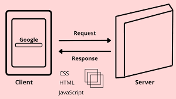

# How does a browser works?

Every website is represented by an IP address. Once you type the address in the address bar and hit enter, browser then uses a database which is worldwide i.e DNS (Domain Name System) to match the IP name that you typed. The browser goes in the DNS and checks the typed match. Here, Computer or us, work as Client and the DNS or location of the website acts as a server and serves our request. This happens over a TCP (Tansmission Control Protocal). TCP protocol is nothing but when client sends the request to the server whether its open for connections and if server has port that can accept this connection. It then acknowledges the request and finally the client sends one message acknowledging it received the server's acknowledgement. This is how the connection between client and server is established. Now the client can request web pages in the form of HTTP protocol (Hyper Text Markup Language). The browser sends the HTTP request to the server. The server then checks or analyses the request, digs into databases to access the information that we want and then sends the response to us. The response is sent in the form of an HTML as its the basic building block of every website. Sometimes, it server may take time to process the information as it should process the requested data and then send to the client.

## How do you see the window of response?

The browser's job is to build the webpage at this time. Browser builds the webpage that is seen on the screen that starts with HTML, shows some images, videos blocks on the page and the page is ready to see.

## Does browser store information once serached?

Once you visit a website, browser keeps a copy of it in a cache and next time when you visit or request the same search your websites shows up a little faster as browser takes less data to download and send it updated to us.

### Web Browser works as a Client/Server model.

## Components of Web Browser:

### 1. User Interface-

It is typical page that we see once we open the browser. It gives features of search, bookmarking the web address and so on.

### 2. Browser engine -

It connects the UI with the engine. It monitors multiple input requests.

### 3. Networking -

It provides the URL and manages, privacy and communication.

### 4. Data Storage-

The cookies store information as the data source is an uniform layer that the browsers use. Storage processes like IndexedDB, WebSQL, localStorage, etc works well on browsers. localStorage and sessionStorage are web storage objects that are used to share information on the browser.

### 5. JavaScript Interpreter-

It interpretes request into javascript code document and executes it. Then engine shows the translation on the screen to the users.

## How does a rendering machine work?

This component is responsible for rendering a specific web page requested by the user on their screen. It interpretes HTML and XML docs along with images that are styled used CSS and final layout is generated which is displayed as response on the website as a UI.
